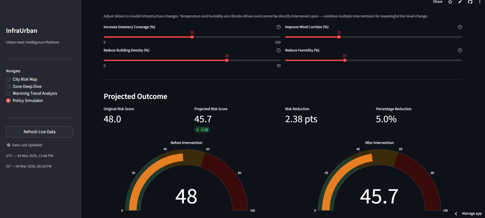
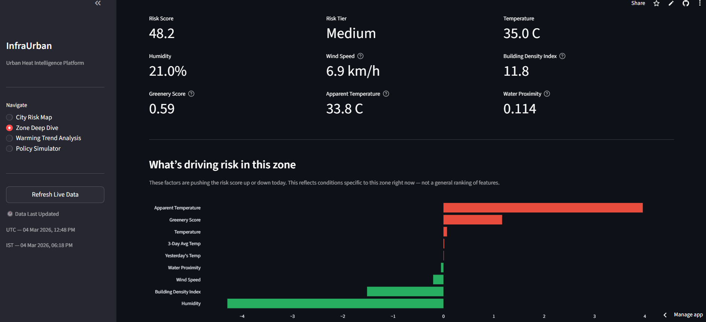

# InfraUrban — Urban Heat Intelligence Platform

A geospatial ML system for real-time urban heat risk scoring across 24 zones in 6 Indian cities, built as a decision-support tool for urban planners, climate researchers, and policy teams.

**Live Demo — [link after deployment]**

---





---

## What It Does

InfraUrban ingests live weather data, geospatial structural proxies (building density, greenery coverage, water proximity), and 5 years of historical climate records to compute zone-level heat risk scores, detect long-term warming trends, and simulate the projected impact of infrastructure interventions — updated daily via a manual refresh or automated pipeline.

---

## Features

**Real-Time Risk Scoring** — XGBoost model scores 24 zones using live weather pulled from Open-Meteo API, combined with static structural features per zone.

**SHAP Explainability** — Per-zone local feature attribution identifying which factors are driving or suppressing today's risk score.

**7-Day Forward Forecast** — Predicted risk scores computed by passing Open-Meteo forecast data through the trained model.

**Warming Trend Analysis** — Linear regression slope detection across 5-year temperature records to identify zones with statistically significant long-term warming.

**Policy Simulator** — Rule-based intervention simulator estimating projected risk reduction under infrastructure changes: greenery expansion, building density reduction, and wind corridor planning.

**Daily Pipeline** — Automated refresh pipeline with a manual refresh option built into the dashboard sidebar.

---

## Model Performance

| Metric | Value |
|---|---|
| RMSE on 2025 holdout | 0.52 |
| R² on 2025 holdout | 0.996 |
| Naive lag-1 baseline RMSE | 1.35 |
| Improvement over baseline | 61.9% |

Trained on 2021–2024 daily aggregated climate data. Evaluated on fully unseen 2025 data using a time-based forward split with no temporal leakage.

The model significantly outperforms a naive lag-1 persistence baseline, demonstrating predictive signal beyond simple temporal carry-forward. The target heat risk index is an engineered weighted composite of climatic exposure and structural vulnerability features — high R² reflects this deterministic structure rather than direct temperature forecasting.

---

## Evaluation Strategy

- Compared against naive lag-1 persistence baseline
- Metrics: RMSE for error magnitude, R² for explained variance
- Evaluated on fully unseen 2025 data to simulate real deployment conditions

---

## Design Decisions

**Time-based forward split** — Training on 2021–2024 and testing on 2025 prevents any form of temporal leakage. Random splits on time-series data would inflate performance metrics artificially.

**Daily aggregation** — Hourly data collapsed to daily averages to reduce noise from short-term volatility while preserving meaningful thermal patterns across seasons.

**Composite risk index scaled 0–100** — Engineered for policy interpretability rather than raw meteorological output. Planners can act on a risk tier; they cannot act on a raw regression residual.

**Rule-based policy simulator** — Uses the domain formula directly instead of retraining on intervention scenarios, enabling fast interactive inference without model overhead.

**Local SHAP over global importance** — Chosen to enable per-zone decision interpretability rather than aggregated feature rankings. A planner in Dharavi needs to know what drives Dharavi's risk, not the average across all zones.

**SQLite over PostgreSQL** — Chosen for portability in a portfolio context. Production deployment would use PostgreSQL with proper indexing and connection pooling.

---

## Architecture

```
Open-Meteo API (historical + live + forecast)
OpenStreetMap via OSMnx (building density, greenery, water proximity)
        |
        v
Ingestion Pipeline — Python, SQLAlchemy, SQLite
        |
        v
Feature Engineering — daily aggregates, rolling lag features, composite risk score
        |
        v
ML Layer
├── XGBoost Regression        — real-time risk scorer
├── SHAP TreeExplainer        — local feature attribution per zone
├── Linear Regression Slopes  — 5-year warming trend detection
└── Rule-Based Simulator      — infrastructure intervention projection
        |
        v
Streamlit Dashboard — 4 pages
├── City Risk Map
├── Zone Deep Dive
├── Warming Trend Analysis
└── Policy Simulator
```

---

## Tech Stack

| Layer | Tools |
|---|---|
| Data Engineering | Python, Pandas, SQLite, SQLAlchemy, OSMnx |
| Machine Learning | XGBoost, Scikit-learn, SHAP |
| APIs | Open-Meteo (historical + forecast), OpenStreetMap |
| Dashboard | Streamlit, Folium, Plotly |
| Scheduling | APScheduler |

---

## Project Structure

```
infraurban/
├── ingestion/
│   ├── historical_weather.py    # 5-year hourly climate data via Open-Meteo
│   ├── live_weather.py          # Real-time weather fetch and risk scoring
│   ├── forecast_weather.py      # 7-day forward predictions
│   └── osm_features.py          # Building density, greenery, water proximity via OSMnx
├── transformation/
│   └── feature_engineering.py  # Daily aggregates, lag features, composite risk score
├── ml/
│   ├── train.py                 # XGBoost training with SHAP computation
│   ├── acceleration.py          # Warming trend slope detection
│   └── evaluate.py              # Baseline comparison and metrics
├── dashboard/
│   ├── app.py                   # Streamlit entry point and navigation
│   ├── utils.py                 # Shared data loaders and helpers
│   └── pages/
│       ├── city_map.py          # City Risk Map page
│       ├── zone_dive.py         # Zone Deep Dive page
│       ├── acceleration.py      # Warming Trend Analysis page
│       └── policy_simulator.py  # Policy Simulator page
├── utils/
│   ├── db.py                    # SQLite connection and schema init
│   ├── zones.py                 # Zone definitions for 24 zones across 6 cities
│   └── pipeline.py              # Orchestrated refresh pipeline
└── main.py                      # Local entry point: runs pipeline then launches dashboard
```

---

## Cities and Zones

| City | Zones |
|---|---|
| Delhi | Connaught Place, Rohini, Shahdara, Dwarka |
| Mumbai | Bandra, Dharavi, Borivali, Colaba |
| Chennai | Adyar, Ambattur, T Nagar, Sholinganallur |
| Kolkata | Salt Lake, Howrah, Park Street, Dum Dum |
| Ahmedabad | Navrangpura, Maninagar, Chandkheda, Vatva |
| Jaipur | Walled City, Mansarovar, Vaishali Nagar, Malviya Nagar |

---

## Setup

```bash
git clone https://github.com/arushiiii18/urban-heat-intelligence.git
cd urban-heat-intelligence
python -m venv venv

# Windows
venv\Scripts\activate

# Mac/Linux
source venv/bin/activate

pip install -r requirements.txt
python main.py
```

`main.py` runs the full data pipeline once then launches the Streamlit dashboard automatically.

To retrain the model from scratch:

```bash
python ingestion/historical_weather.py
python ingestion/osm_features.py
python transformation/feature_engineering.py
python ml/train.py
```

---

## Data Sources

**Open-Meteo** — Free historical and forecast weather API. No authentication required.

**OpenStreetMap via OSMnx** — Building footprints, green space coverage, and water body proximity extracted within a 3km radius of each zone centroid.

---

## Limitations

- Risk index is a composite proxy, not a direct measure of health outcomes
- Forecast accuracy degrades beyond day 3 and is dependent on Open-Meteo's own model reliability
- Micro-climate effects and real-time ground sensor data are not incorporated
- 5-year training window may not fully capture longer-term climate regime shifts
- Intervention impact estimates in the policy simulator assume linear scaling, which may not hold for large structural changes